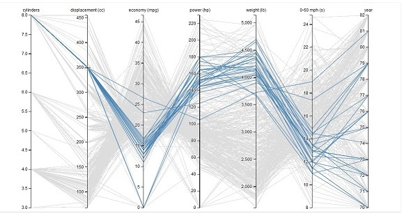

# DataVizOverview
-- This is still a rough draft!!

## What is Data Visualization?

Bottom line: data visualisation helps us see patterns in data that would be difficult to see from a list of numbers and other data structures. 

## Useful simple charts for seeing patterns
Simple charts are usually best, for readability.

### Line chart
Great for seeing trends, like change over time or volume over temperature.

### Bar chart
Great for seeing how groups compare with each other

### Scatter plot
Great for seeing how similar individual items are to each other, with two variables

## Useful complex charts for seeing context

### Parallel Coordinate Graphs
Multi-variate visual comparisons. Can highlight what contributes to groupings and outliers. ...

+ This example allows draging-reordering of axis: https://bl.ocks.org/jasondavies/1341281

### Maps
Maps can show context in a geospatial setting. How close is that restaurant to the theater? Two dimensions are already used by positioning on the map, but can use color and icons to indicate attributes of data points.

